# 27 Top-Tier AI-Powered Productivity Tools You Must Know in 2025

Tired of spending more time managing your schedule than actually working? Juggling tasks across spreadsheets, sticky notes, and five different apps while missing deadlines anyway? AI scheduling assistants and productivity platforms eliminate that chaos by automatically organizing your day, prioritizing what matters, and adapting in real-time when plans change. These tools turn overwhelming to-do lists into executable schedules, giving you back hours each week for focused work instead of endless calendar Tetris.

## [Motion](https://www.usemotion.com)

An AI-powered productivity platform that automatically builds your perfect daily schedule by intelligently combining tasks, projects, meetings, and deadlines into one unified calendar.

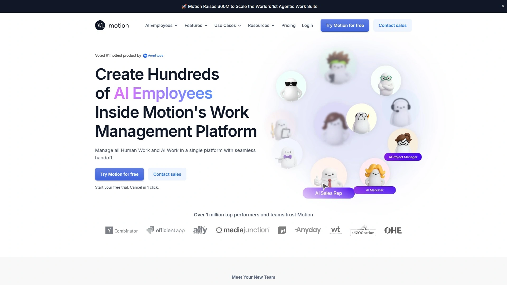

Motion distinguishes itself by functioning as a complete AI assistant that manages your entire workday rather than just one aspect of productivity. The platform analyzes your tasks, deadlines, priorities, and available time slots to automatically schedule everything in the most efficient order. When meetings run long or emergencies arise, Motion instantly recalculates and reshuffles your entire schedule without requiring manual adjustments.

The AI Task Manager auto-schedules work based on hundreds of thousands of data points including deadlines, priorities, and dependencies. It surfaces your top priority each hour so you always know the single most important thing to tackle first. When Motion detects a task is at risk of missing its deadline, it proactively warns you days or weeks in advance. This early warning system helps you address potential delays before they cascade into bigger problems.

**Project Workflow Templates** allow teams to templatize their proven processes, ensuring operational excellence at every step. Tasks are automatically assigned and scheduled based on dependencies and team members' availability. AI Meeting Assistant eliminates scheduling back-and-forth by finding optimal meeting times based on your preferences. The platform even embeds booking pages on your website so prospects can schedule directly into your ideal time slots.

Recently added **AI Employees** pull context from your tasks, projects, and meeting notes to actually help complete work rather than just manage it. Over 1 million top performers and teams trust Motion for managing their productivity. Individual plans cost $34 monthly, while team plans run $20 per user monthly with annual billing discounts.

## [Reclaim.ai](https://reclaim.ai)

A smart calendar assistant that automatically defends time for your tasks, habits, and focus sessions while keeping you available for important meetings.

Reclaim excels at creating work-life balance through intelligent time blocking. The platform automatically finds optimal times in your schedule for recurring habits like exercise, lunch breaks, and deep work sessions. It blocks this time as flexible holds that appear "free" to others, automatically adjusting when urgent meetings arise. This flexibility maximizes your availability for meetings while still protecting time for essential activities.

Real-time rescheduling sets Reclaim apart from competitors that only adjust schedules once daily. As your calendar changes throughout the day, Reclaim instantly reorganizes everything around your highest priorities. Task integrations sync with Asana, Todoist, Google Tasks, Jira, and other tools to auto-schedule work directly from your existing project management systems.

The platform uses AI to make intelligent tradeoffs between tasks, habits, and meetings based on priority levels you set. Smart 1:1s automatically find optimal recurring meeting times for all your direct reports and reschedules conflicts without manual intervention. Buffer time features add breathing room between meetings automatically. Focus time goals help you hit weekly deep work targets with circuit breakers that prevent overcommitment.

Generous free plan provides core functionality, with paid plans starting at $8 per user monthly. Calendar optimization typically creates 6-8 hours of defended focus time blocks within 24 hours of initial setup.

## [Clockwise](https://www.getclockwise.com)

A team-focused AI calendar that optimizes meeting schedules across your organization to create uninterrupted focus time for everyone.

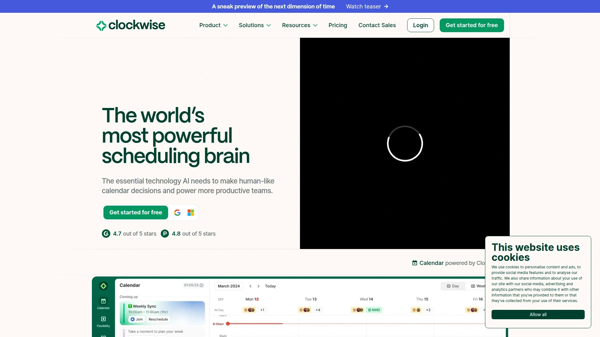

Clockwise specializes in coordinating schedules for entire teams rather than just individuals. The platform analyzes calendars across your organization to identify the best meeting times that minimize disruption for all participants. It automatically moves flexible meetings to create larger blocks of uninterrupted focus time, typically generating 4-6 hour focus blocks within 12-24 hours as team data synchronizes.

The system reschedules once daily rather than continuously, taking a batch approach to calendar optimization. While less dynamic than real-time adjusters, this method works well for teams with predictable schedules. Clockwise creates generic "Focus Time" blocks that you can mark as either completely free or entirely busy, though this binary approach offers less flexibility than competitors.

Team coordination features make it easy to find meeting times that work for groups without endless back-and-forth. The platform reduces calendar fragmentation by consolidating meetings into specific time windows, leaving longer stretches clear for focused work. Integration with Slack keeps teams updated on schedule changes.

Best suited for organizations where multiple people need coordinated schedules rather than solo users managing personal productivity. Pricing information requires contacting sales for custom quotes.

## [Calendly](https://calendly.com)

The most widely recognized meeting scheduling platform that eliminates booking back-and-forth through customizable availability pages.

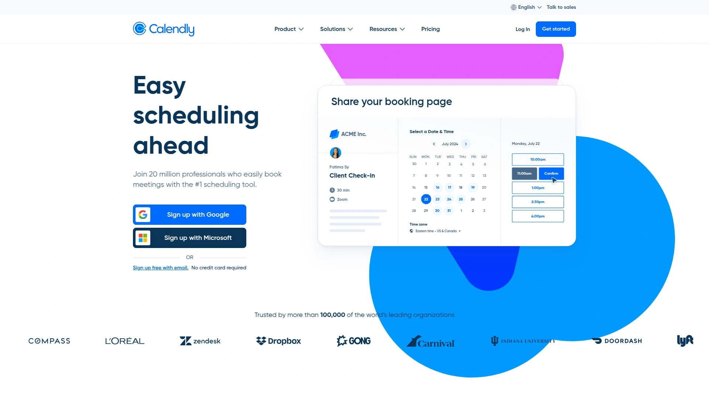

Calendly pioneered the self-service booking model where you share your availability link and invitees pick times that work for them. The platform integrates seamlessly with Google Calendar, Outlook, and iCloud to prevent double-bookings. Automated confirmation emails and reminders significantly reduce no-shows.

Customizable booking links let you maintain brand consistency with logos, color schemes, and personalized text. Multiple event types handle one-on-one meetings, group sessions, round-robin team scheduling, and recurring appointments. Time zone detection automatically adjusts displayed times for international participants. Buffer times between meetings prevent back-to-back scheduling fatigue.

Meeting polls allow participants to vote on preferred times, making group scheduling democratic. Routing forms qualify leads and direct them to appropriate team members before booking. Payment collection through Stripe and Square turns consultations into paid appointments immediately. Integration marketplace connects to Zoom, Salesforce, HubSpot, and hundreds of other business tools.

Free tier offers basic scheduling functionality, while paid plans start at $10 monthly for professionals and scale to $16 monthly for teams. Mobile apps for iOS and Android provide full scheduling capabilities on the go.

## [Cal.com](https://cal.com)

An open-source scheduling platform offering self-hosting options and unlimited calendar connections for privacy-conscious users and developers.

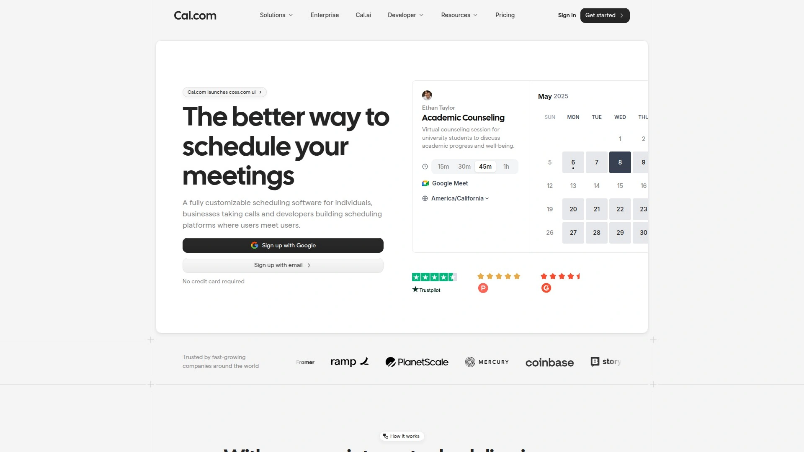

Cal.com differentiates through its open-source codebase, allowing technically savvy users to customize functionality and host on their own infrastructure. This approach appeals to companies with strict data privacy requirements or unique workflow needs. Unlimited calendar connections remove the arbitrary six-calendar limit imposed by some competitors.

AI scheduling assistant handles booking coordination through natural language conversations. The platform supports all standard scheduling features including one-on-one meetings, group sessions, round-robin distribution, and recurring appointments. Calendar overlay functionality displays your existing schedule directly on booking pages, giving invitees more context.

Customization extends beyond visual branding to include code-level modifications for power users. Team scheduling shows collective availability across multiple members. Integration capabilities connect to major calendar services and productivity tools through APIs. SMS and email reminders keep everyone informed.

Free plan provides core functionality, while Pro tier adds advanced features at $12 monthly. The self-hosting option appeals to enterprises requiring complete data control. Target audience leans toward software enthusiasts and technical teams comfortable with open-source tools.

## [Trevor AI](https://www.trevorai.com)

A daily planning app using time-blocking techniques to transform scattered to-do lists into structured, actionable schedules.

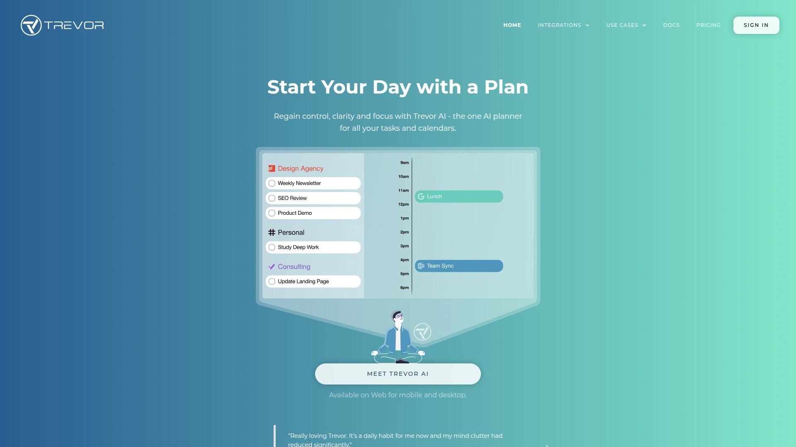

Trevor AI focuses specifically on helping users create realistic daily plans rather than just managing endless task lists. You input tasks with durations and priorities, then Trevor schedules them into your calendar using time-blocking methods. This visual approach forces honest conversations about how much time tasks actually require versus how much time you have available.

The platform integrates with your existing to-do list tools and calendar, pulling tasks in and scheduling them optimally throughout your day. When something takes longer than expected, simply update the duration and Trevor recalculates the rest of your schedule. This flexibility prevents the cascading failures that happen when plans fall apart mid-day.

Time blocking naturally leads to deep work by allowing your mind to focus on one specific task without constantly worrying about everything else competing for attention. Trevor emphasizes creating sustainable daily plans that actually match your capacity, reducing overcommitment stress. The drag-and-drop interface makes schedule adjustments intuitive.

Philosophy centers on the superpower of a daily plan in the digital economy, helping users control motivation through realistic scheduling. Suitable for solo users who prefer clean interfaces and straightforward planning without team collaboration features.

## [Akiflow](https://akiflow.com)

A command center for high-performing professionals that consolidates tasks from Slack, Gmail, Notion, and other tools into one unified schedule.

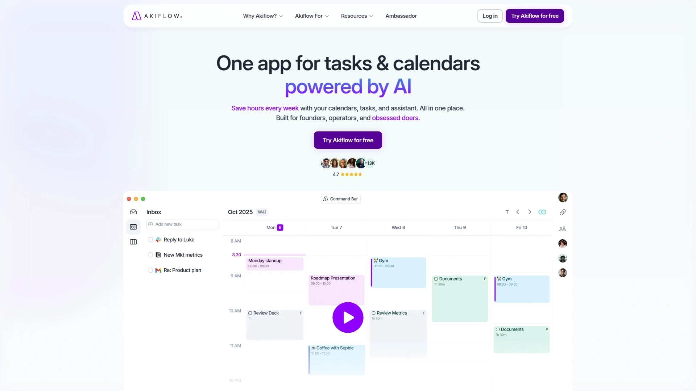

Akiflow serves power users who want to work quickly and decisively without switching between multiple apps. The platform pulls tasks from disparate sources like Slack messages, Gmail threads, Notion pages, Asana projects, and Todoist lists into a centralized inbox. Universal keyboard shortcuts enable rapid task capture and triage.

Time blocking integration lets you drag tasks directly onto your calendar to create focused work sessions. The calendar view shows your entire day including both scheduled meetings and planned tasks. Deep integrations mean that starring an email in Gmail or getting tagged in Slack automatically surfaces those items in Akiflow. Custom rules auto-schedule tasks or assign tags based on their source.

Built for speed over deliberation, making it ideal for professionals managing high input volumes who need to process information quickly. Structured daily planning with strong integrations reduces the cognitive load of deciding where tasks live. Cross-platform availability on Mac, Windows, Linux, iOS, and Android ensures access anywhere.

Pricing sits at the premium end, reflecting its positioning as a professional tool. The platform suits executives, founders, and high-output individuals whose bottleneck is task organization rather than task completion.

## [Sunsama](https://www.sunsama.com)

A mindful daily planner guiding users through intentional planning rituals that build sustainable, focused work habits.

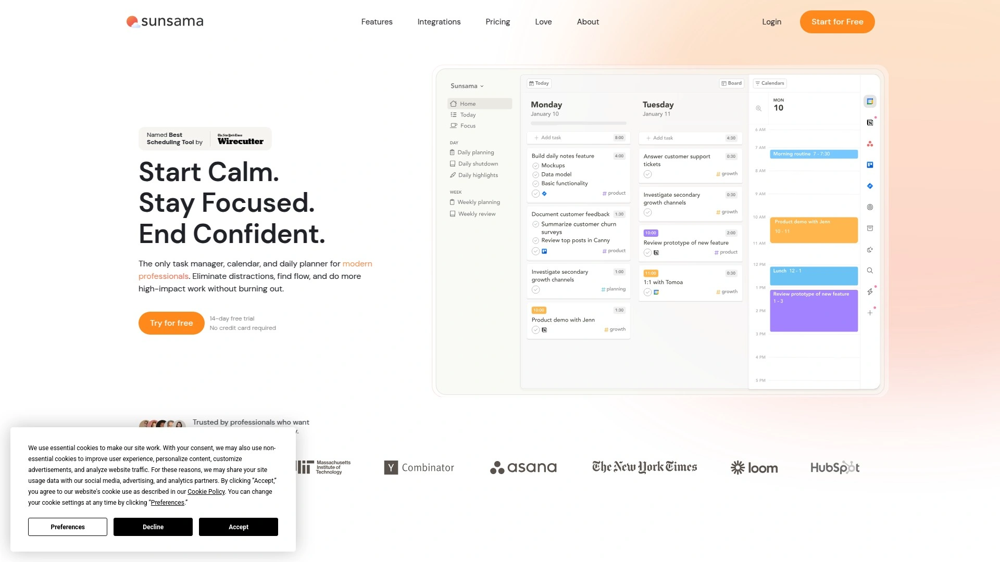

Sunsama takes a deliberate, reflective approach to productivity rather than emphasizing speed. The platform guides you through daily planning sessions where you set intentions, estimate task effort, and build schedules that feel sustainable. This slower, more thoughtful process appeals to users who value mindful execution over rapid task processing.

Instead of automatically pulling in every task from connected tools, Sunsama lets you browse your project management systems and hand-pick what you'll work on today. This intentional selection helps reduce overwhelm but requires more manual effort. Time blocking places chosen tasks onto your calendar with realistic duration estimates.

Daily shutdown ritual prompts reflection on what got accomplished and helps plan tomorrow. Focus mode removes distractions when you're working on specific tasks. Integrations connect to Gmail, ClickUp, Trello, Outlook, and other common productivity tools. The platform emphasizes work-life balance through encouraging reasonable daily commitments.

Pricing reflects premium positioning at approximately $20 monthly, though exact rates vary by plan. Best suited for individuals who prefer guidance and structure over rapid-fire task management, particularly those prone to overcommitment.

## [BeforeSunset AI](https://www.beforesunset.ai)

An AI-powered daily planner that breaks down overwhelming brain dumps into scheduled tasks with focus modes for deep work.

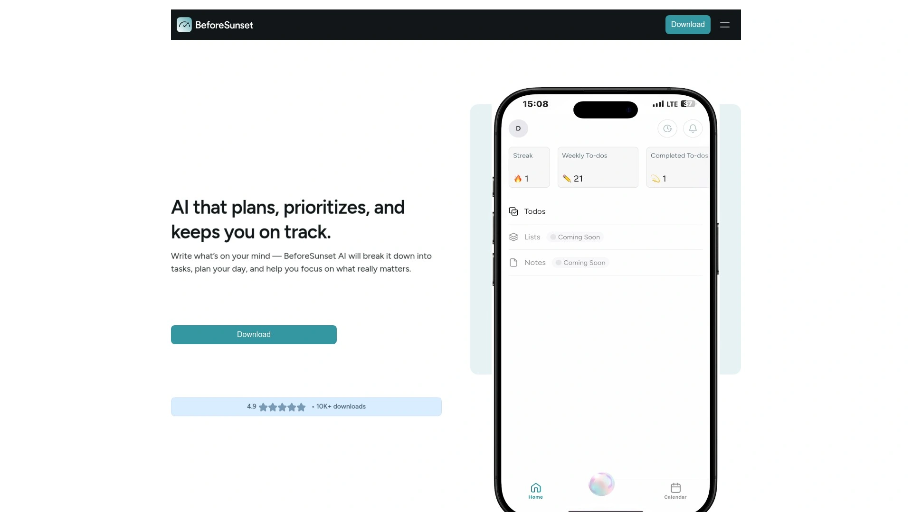

BeforeSunset AI positions itself as an affordable alternative to premium productivity tools while still offering intelligent planning assistance. Write what's on your mind in natural language, and the AI breaks it down into discrete, actionable tasks with suggested time allocations. This brain-dump-to-plan conversion helps clear mental clutter.

Focus modes minimize distractions during scheduled work blocks, helping maintain concentration on current tasks. The platform provides daily planning structure without the complexity or price tag of enterprise solutions. Goal tracking keeps longer-term objectives visible alongside daily tasks.

The sweet spot between simplicity and AI assistance makes it accessible for users who find tools like Motion or Reclaim overwhelming but still want automated help. Calendar integration displays your full schedule including meetings and blocked work time. Natural language processing understands conversational task descriptions.

Significantly more affordable than competing AI planners, making it attractive for individuals and small teams testing AI-assisted planning. The platform suits users seeking structure and AI guidance without needing extensive team collaboration features.

## [Lindy](https://www.lindy.ai)

A platform deploying multiple specialized AI assistants that collaborate to manage your calendar, tasks, and workflows through natural language.

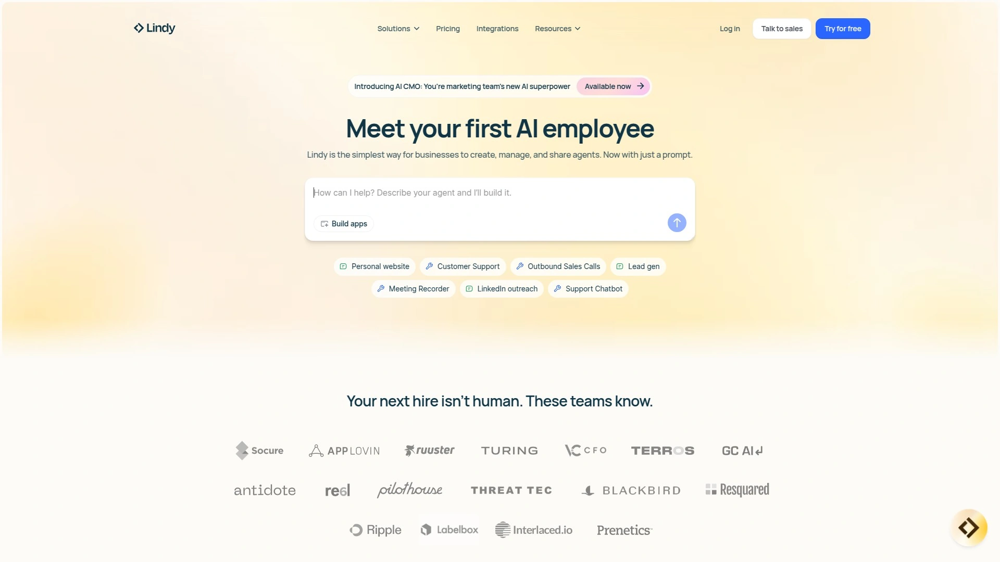

Lindy takes a unique approach by offering mini AI assistants called "Lindies" that each handle specific responsibilities. An Exercise Scheduler Lindy coordinates with a Business Meeting Lindy to integrate fitness sessions with your work calendar. These AI assistants collaborate seamlessly, creating an ensemble that manages your entire schedule.

Calendar management interprets natural language requests to find suitable time slots and automatically syncs with Google or Outlook calendars. The platform provides feedback, reminders, and to-dos while learning your preferences over time. Templates offer pre-configured Lindies for common use cases like mood tracking, life coaching, and financial assistance.

Proactive learning means Lindy autonomously manages routine tasks upon your approval rather than waiting for instructions. Integration capabilities extend beyond scheduling into full workflow automation. The platform operates unobtrusively in the background, visible only when needed.

Suited for busy professionals seeking comprehensive assistance that extends beyond simple scheduling. Free trial offers one week of access, then $29.99 monthly. The multi-assistant approach works well for users managing multiple commitments across personal and professional life.

## [Vimcal](https://www.vimcal.com)

The world's fastest calendar designed for people with too many meetings, featuring AI scheduling and smart group coordination.

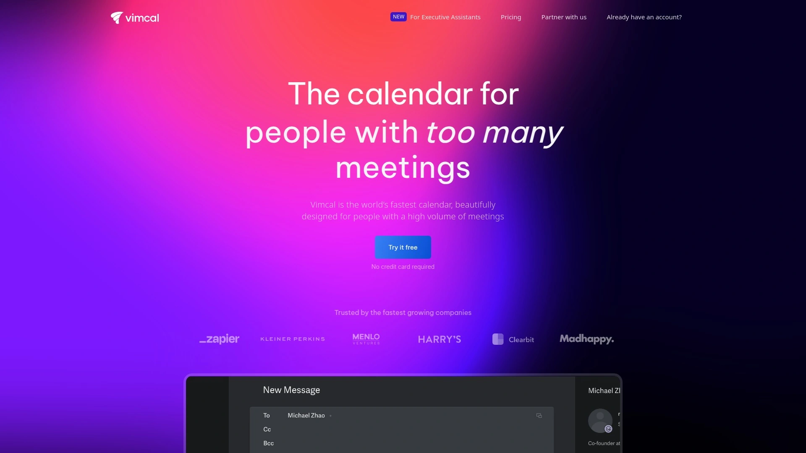

Vimcal emphasizes speed above all else, providing keyboard shortcuts and rapid interactions for professionals drowning in meetings. AI scheduling assistant handles heavy lifting for group meetings, finding optimal times across multiple participants. When someone sends you a Calendly link or list of available times, simply paste it into Vimcal and instantly see which slots match your availability.

AI-powered summaries provide context on meeting guests right in the invite, eliminating pre-meeting research. Social profiles and company dossiers appear automatically for everyone you meet with. Focus mode covers your calendar with beautiful backdrops, pomodoro timers, and ambient sounds when it's time for deep work.

Unified calendar view consolidates work and personal accounts, preventing the common mistake of booking on the wrong calendar. Customizable booking pages with logo and branding maintain professional appearance. The platform serves executives and founders who live in their calendars and need every interaction optimized for speed.

Pricing targets professional users who value time savings over cost. The focus on velocity makes Vimcal particularly suitable for high-meeting-volume roles like sales, recruiting, and executive leadership.

## [Todoist](https://todoist.com)

A powerful task manager with natural language processing, labels, filters, and priority levels for organizing both simple and complex projects.

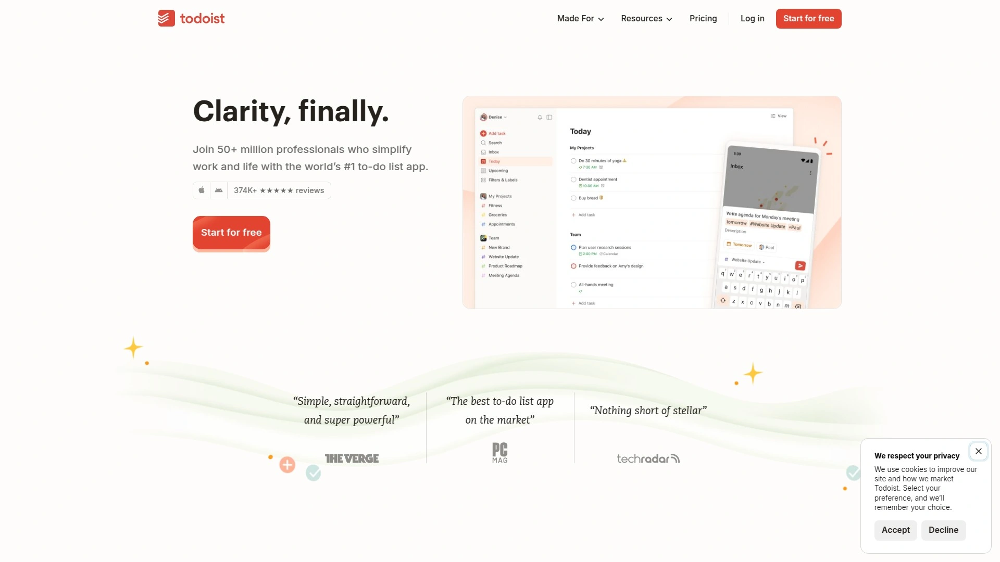

Todoist has built a reputation for clean design and robust functionality that appeals to individuals and teams. Advanced natural language processing understands complex commands like "every other Tuesday" or "next weekend," automatically setting due dates based on conversational input. Four priority levels with visual indicators help focus on what matters most.

Sub-tasks support multiple hierarchy levels for breaking down complex projects into manageable pieces. Labels and filters provide powerful organization without cluttering the interface. Quick add feature accessible via keyboard shortcuts and browser extensions enables rapid task capture from any screen. Karma system gamifies productivity by tracking task completion streaks.

Cross-platform availability on Android, iOS, web, Windows, macOS, and even smartwatches ensures access everywhere. Team collaboration features allow sharing projects, assigning tasks, and commenting on items. Integration capabilities connect to Zapier, Google Calendar, Slack, Gmail, and hundreds of other tools.

Premium plan costs $4 monthly when billed annually, providing excellent value for robust task management. The balance of simplicity and power makes Todoist suitable for both personal productivity and team project coordination.

## [Notion](https://notion.so)

An all-in-one workspace combining notes, databases, wikis, and task management in a highly flexible, customizable environment.

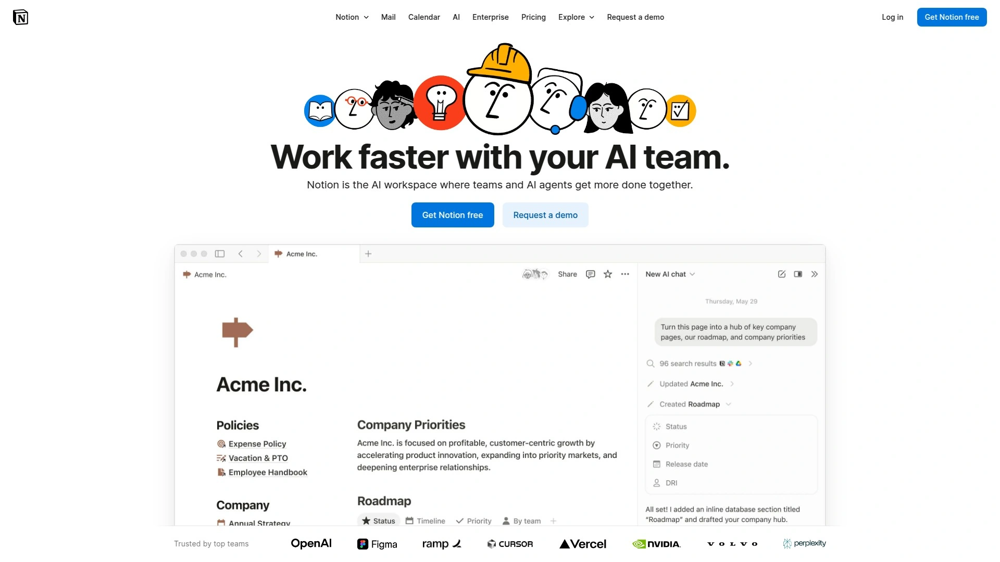

Notion's strength lies in its flexibility as a blank canvas that users can shape to match their exact needs. Databases allow creating custom task systems with properties, filters, and views that traditional to-do apps can't match. Pages can include text, tables, kanban boards, calendars, and embedded content all in one location.

The platform serves as a knowledge base where teams document processes, store resources, and manage projects. Templates accelerate setup for common use cases like meeting notes, project trackers, and personal wikis. Collaborative editing enables real-time teamwork on documents and databases.

Learning curve is steeper than dedicated task managers because of the open-ended structure. Users must design their own systems rather than following prescribed workflows. This flexibility becomes powerful once you invest time in setup but can feel overwhelming initially.

Free personal plan offers substantial functionality, while team plans add collaboration features at reasonable pricing. Notion excels for users who want a unified workspace consolidating multiple tools but struggles as a simple task manager for those wanting straightforward to-do lists.

## [Things 3](https://culturedcode.com/things/)

A beautifully designed task manager exclusive to Apple platforms, featuring elegant project organization and intuitive workflows.

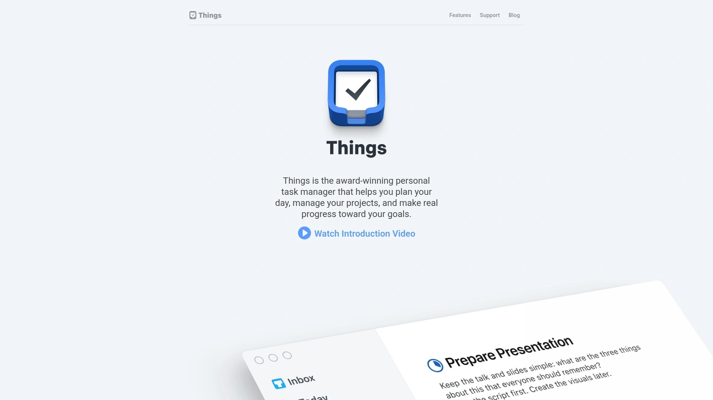

Things 3 prioritizes aesthetics and user experience, creating a task management environment that feels effortless. The interface balances simplicity with powerful organizational capabilities through areas, projects, and headings that maintain clear hierarchy. Checklists within tasks break complex items into smaller steps.

Quick Entry functionality allows task capture from anywhere in macOS using keyboard shortcuts. Today and Upcoming views provide clear visibility into immediate and future commitments. Built-in evening review feature helps plan tomorrow's tasks and maintain momentum. Calendar integration shows events alongside tasks for comprehensive daily planning.

Platform limitation to Apple ecosystem (iPhone, iPad, Mac, Apple Watch) restricts audience but ensures deep OS integration. One-time payment model at $50 eliminates ongoing subscription costs. Syncing via Things Cloud keeps tasks updated across all Apple devices.

Customizable tags enable flexible categorization and searching. The app suits users who appreciate minimalist design and work primarily within Apple's ecosystem. Natural language processing is notably absent compared to competitors like Todoist.

## [Asana](https://asana.com)

A comprehensive project management platform with timeline views, workload management, and automation for teams executing complex initiatives.

Asana serves teams needing robust project management beyond simple task lists. Timeline view visualizes project schedules with dependencies, helping teams understand how delays impact downstream work. Workload management prevents team member burnout by showing capacity and distribution.

Multiple view options including list, board, calendar, and Gantt chart accommodate different working styles. Automation rules trigger actions like task assignments and status updates based on specified conditions. Custom fields add project-specific data points for tracking budgets, priorities, or any relevant metrics.

Portfolio management gives leaders visibility across multiple projects simultaneously. Goals feature connects daily work to strategic objectives. Integration marketplace links to Slack, Microsoft Teams, Google Workspace, and hundreds of other tools.

Free tier supports up to 15 team members with basic features, while Premium tier at $10.99 per user monthly unlocks timeline, reporting, and advanced features. Asana works best for organizations with structured project management needs rather than individuals managing personal tasks.

## [Trello](https://trello.com)

A visual project management tool using kanban boards with cards and lists for intuitive, flexible task organization.

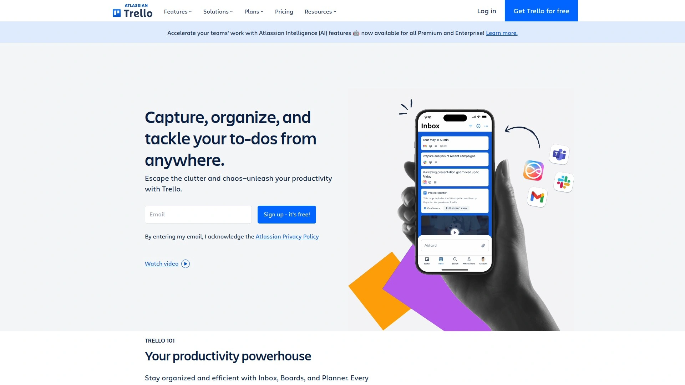

Trello's card-based kanban system makes project visualization immediately intuitive. Boards represent projects, lists represent stages (like To Do, In Progress, Done), and cards represent individual tasks. Drag-and-drop simplicity requires minimal training.

Power-Ups extend functionality with integrations, custom fields, calendar views, and automation. Butler automation creates rules that trigger actions when cards move between lists or meet certain conditions. Checklists within cards break tasks into sub-items. Labels, due dates, and attachments add context to cards.

Team collaboration features include card assignments, comments, and real-time updates. Template gallery provides pre-built boards for common workflows. Mobile apps offer full functionality for managing projects on the go.

Free plan offers unlimited cards and boards with limited Power-Ups, while Standard plan at $5 per user monthly adds unlimited Power-Ups and advanced checklists. Trello suits teams preferring visual, flexible organization over structured project management.

## [Monday.com](https://monday.com)

A highly customizable Work OS with extensive automation, integrations, and views for managing everything from projects to CRM.

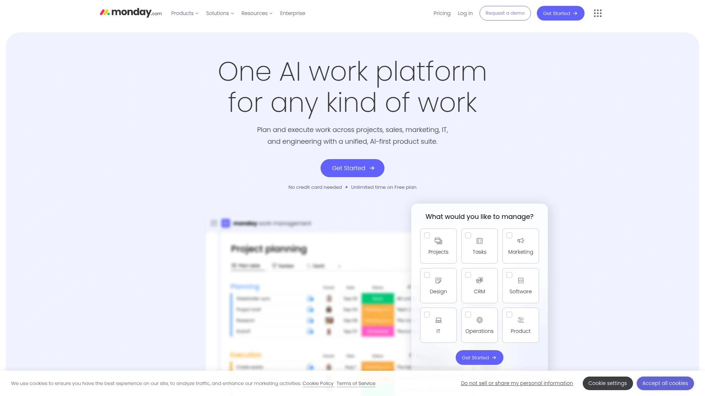

Monday.com positions itself as an operating system for work rather than just project management software. The platform's flexibility allows building custom workflows for diverse use cases including project tracking, CRM, content calendars, and HR processes. Over 200 templates provide starting points for common scenarios.

Automation builder creates rules connecting boards and triggering actions without coding. Multiple views including kanban, Gantt, calendar, and workload charts accommodate different team preferences. Dashboards aggregate data from multiple boards into executive summaries.

Time tracking built directly into tasks helps monitor project budgets and team capacity. Integration platform connects to thousands of external tools. Extensive customization through columns, formulas, and widgets supports virtually any workflow.

Pricing starts higher than competitors at $9 per user monthly for basic plans, scaling to $19 for more features. The platform targets organizations needing flexibility and scalability rather than simple task management.

## [ClickUp](https://clickup.com)

An all-in-one productivity platform consolidating tasks, docs, goals, whiteboards, and chat to replace multiple tools.

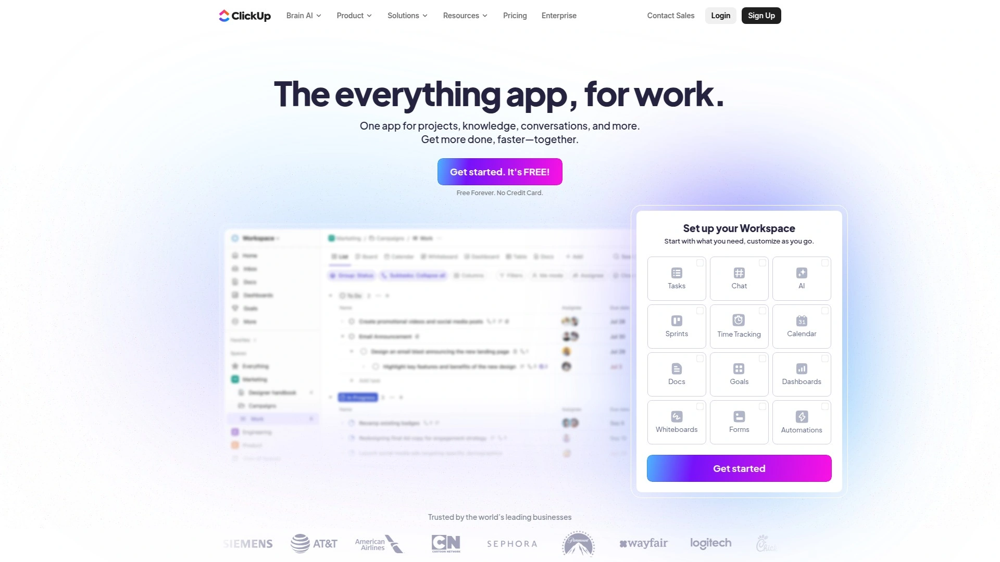

ClickUp's ambitious goal is replacing all your productivity tools with one comprehensive platform. The feature set includes task management, document collaboration, goal tracking, time tracking, mind maps, whiteboards, and team chat. Customizable views and hierarchy accommodate projects of any complexity.

Automation simplifies repetitive work by setting rules for task assignments, status updates, and notifications. AI features assist with writing, summarizing, and task generation. Multiple assignees and subtask hierarchies support complex workflows. Custom fields and statuses tailor the platform to specific team needs.

Integration with 1,000+ external tools via native connections and Zapier ensures compatibility with existing stacks. Template center provides pre-configured workspaces for various industries and use cases. The learning curve reflects the extensive functionality, requiring more onboarding than simpler tools.

Free plan offers generous features for unlimited users, while Unlimited plan at $7 per user monthly unlocks advanced capabilities. ClickUp serves teams wanting comprehensive functionality consolidated in one platform.

## [Ellie Planner](https://ellieplanner.com)

A straightforward time-blocking planner combining calendar integration, task management, and focus features without overwhelming complexity.

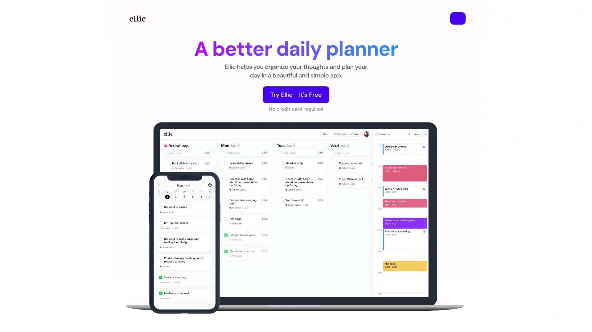

Ellie Planner emphasizes simplicity and time-blocking fundamentals. The platform syncs with Google Calendar and Outlook to display appointments and tasks in unified views. Time-blocking techniques encourage allocating specific blocks for tasks, managing daily workloads efficiently.

Brain dump feature provides dedicated space for capturing ideas and tasks as they arise, later organizing them into actionable items. Customizable views let users tailor interfaces to personal productivity styles. Mobile accessibility ensures schedule management from any location.

Focus on essentials rather than extensive features makes onboarding quick. The platform suits individuals seeking lightweight alternatives to more complex tools like Sunsama. Time-blocking education and guides help users adopt effective planning techniques.

Free plan offers basic functionality, while Pro plan at $9.99 monthly adds features like timeboxing and calendar integration. One-time payment option at $299.99 eliminates ongoing subscription costs. Target audience includes solo professionals wanting structured daily planning without team collaboration complexity.

## [Fantastical](https://flexibits.com/fantastical)

A powerful calendar app for Apple platforms featuring natural language input, beautiful design, and seamless integration across devices.

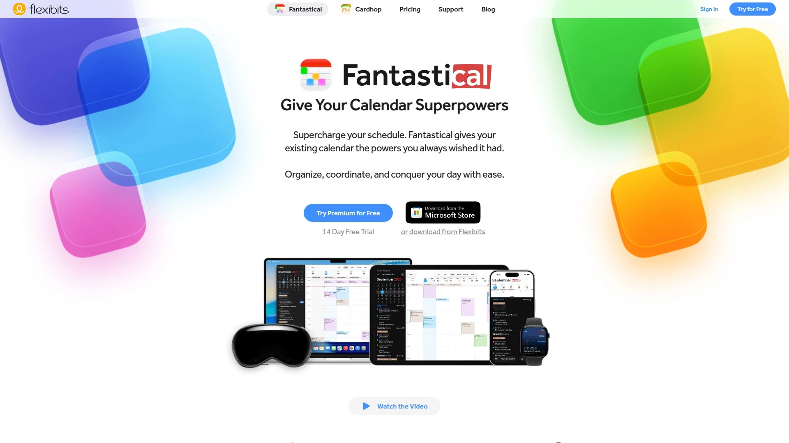

Fantastical has earned acclaim for exceptional user experience and design quality on Apple platforms. Natural language processing creates events and reminders from conversational phrases like "lunch with Sarah next Tuesday at noon". Calendar Sets organize different groups of calendars for easy switching between work, personal, and family views.

Integration with task managers like Todoist and Google Tasks displays tasks alongside calendar events. Weather forecasts in day and week views help plan outdoor activities. Conference call detection automatically adds video meeting links to events.

Time zone support handles international scheduling complexity. Apple Watch and iPhone widgets provide quick access to upcoming events. Customizable views and color-coding make calendars visually scannable.

Subscription model at $4.75 per user monthly when billed annually provides access across iPhone, iPad, Mac, and Apple Watch. The platform exclusively serves Apple ecosystem users, limiting cross-platform teams. Fantastical suits users prioritizing elegant design and natural language convenience.

## [Doodle](https://doodle.com)

A meeting scheduling tool specializing in group polls that eliminate back-and-forth emails when coordinating multiple participants.

Doodle pioneered the polling approach to group scheduling. Create a poll with potential meeting times, share the link with participants, and everyone votes on their preferences. The time with the most votes becomes the scheduled meeting. Participants can vote without creating accounts, ensuring full participation.

Calendar integration with Google Calendar, Outlook, and iCloud prevents double-bookings by syncing confirmed meetings. Booking pages display real-time availability for one-on-one scheduling similar to Calendly. The platform handles both internal team coordination and external scheduling.

Automated reminders reduce no-shows by sending notifications to all participants. Time zone management automatically adjusts displayed times for international groups. The tool simplifies coordination for events ranging from small meetings to large conferences.

Free plan offers basic polling functionality, while paid plans add features like removing Doodle branding and

 advanced customization. Doodle works best when scheduling groups where availability varies widely, making polls more efficient than individual outreach.

## [Morgen](https://www.morgen.so)

A unified calendar and task management app integrating multiple calendars and to-do systems with AI daily planning assistance.

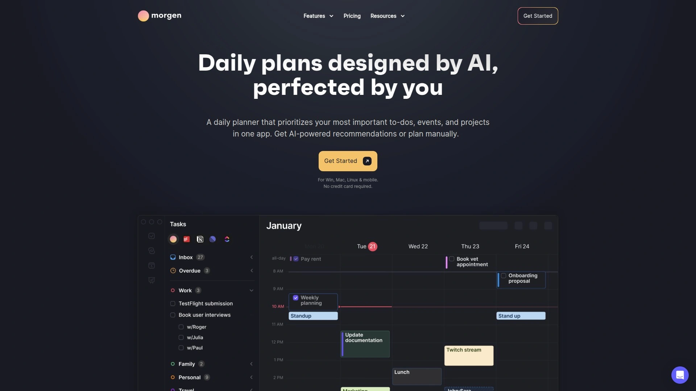

Morgen consolidates calendars from Google, Office 365, iCloud, and other providers into single unified views. Task integration pulls from Todoist, Google Tasks, and other task managers, though with less depth than specialized consolidators like Akiflow. Cross-platform availability on Mac, Windows, Linux, iOS, and Android ensures consistent access.

Time-blocking support encourages allocating specific periods for tasks alongside meetings. Scheduling tools help coordinate meetings by finding mutually available times. Offline functionality maintains access to calendars and tasks without internet connectivity. Customizable notifications and reminders keep users informed.

Clean interface prioritizes usability over extensive feature lists. Analytics provide insights into scheduling patterns and time allocation. The platform serves users wanting straightforward calendar consolidation without overwhelming complexity.

Pricing at $9 monthly positions Morgen as mid-tier option. Suitable for individuals managing multiple calendar accounts who want unified visibility and basic task integration.

## [Any.do](https://www.any.do)

A simple task manager integrating calendar and checklist functionality with voice entry and AI features for easy task capture.

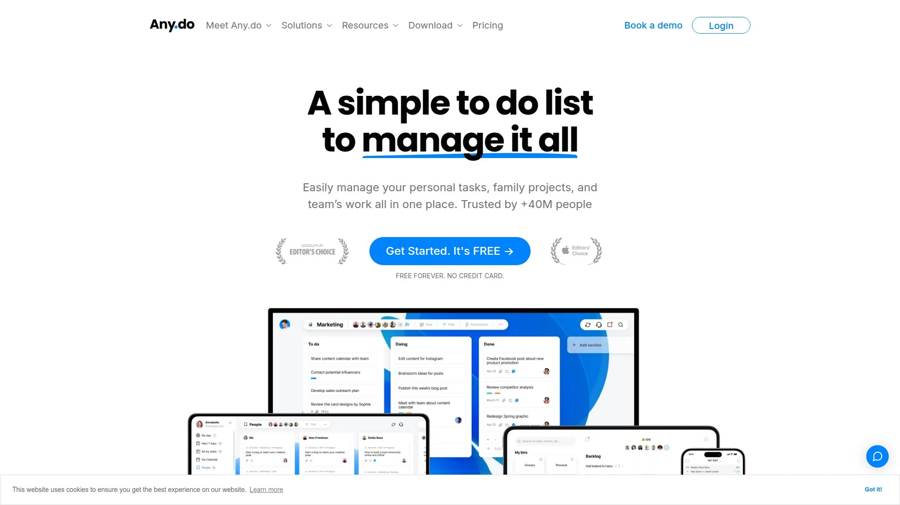

Any.do emphasizes ease of use for task and calendar management in one app. The interface simplifies task organization even for complex projects through intuitive categorization and prioritization. Calendar integration provides unified views of tasks and events for comprehensive daily planning.

Voice entry allows hands-free task addition, convenient when typing isn't practical. AI features enhance user experience and task management efficiency, though less developed than dedicated AI planners. Customizable reminders ensure important tasks aren't forgotten.

Collaboration tools enable sharing tasks and lists with others for team and family projects. Cross-platform accessibility on iOS, Android, web, and desktop maintains task access everywhere. Integration with WhatsApp, Gmail, Slack, and smartwatches extends functionality.

Free version provides basic task management, while Premium version at $36 annually unlocks advanced features. Any.do suits users wanting straightforward task and calendar management without steep learning curves.

## [TickTick](https://ticktick.com)

A feature-rich task manager with calendar views, habit tracking, and pomodoro timer for comprehensive personal productivity.

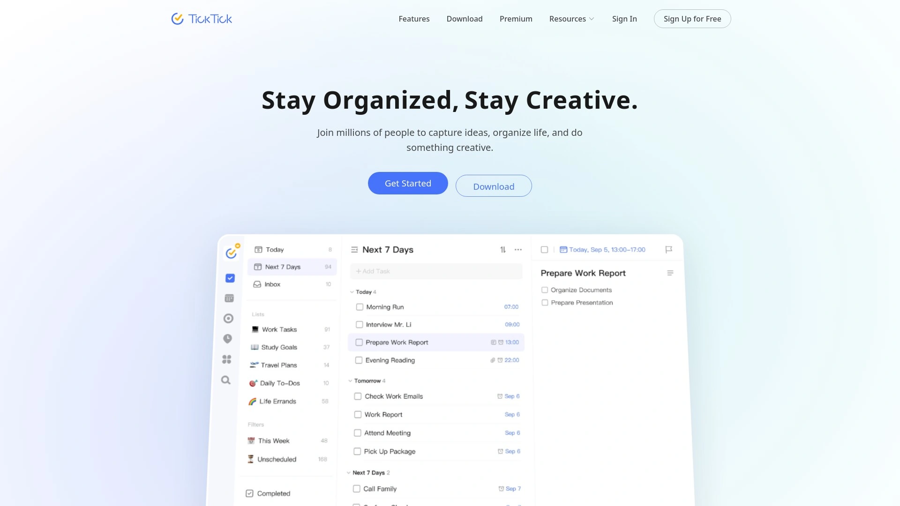

TickTick offers extensive functionality bridging simple to-do lists and complex project management. Multiple views including list, calendar, and timeline accommodate different planning styles. Habit tracking helps build consistent routines by monitoring daily, weekly, or custom frequency goals.

Built-in pomodoro timer facilitates focused work sessions using time-tested productivity techniques. Natural language input creates tasks with due dates, priorities, and tags from conversational phrases. Subtasks and checklists break complex projects into manageable components.

Calendar integration displays tasks alongside scheduled events. Collaboration features allow sharing lists and assigning tasks to team members. Cross-platform syncing ensures task access on web, mobile, and desktop.

Integration capabilities through Zapier, Make, and other platforms connect TickTick to broader productivity ecosystems. Free plan provides core functionality, while Premium tier adds features like calendar view and custom smart lists. TickTick serves users wanting comprehensive task management with built-in productivity tools.

## [Airtable](https://airtable.com)

A flexible database-spreadsheet hybrid enabling custom project management, CRM, and workflow systems through relational tables.

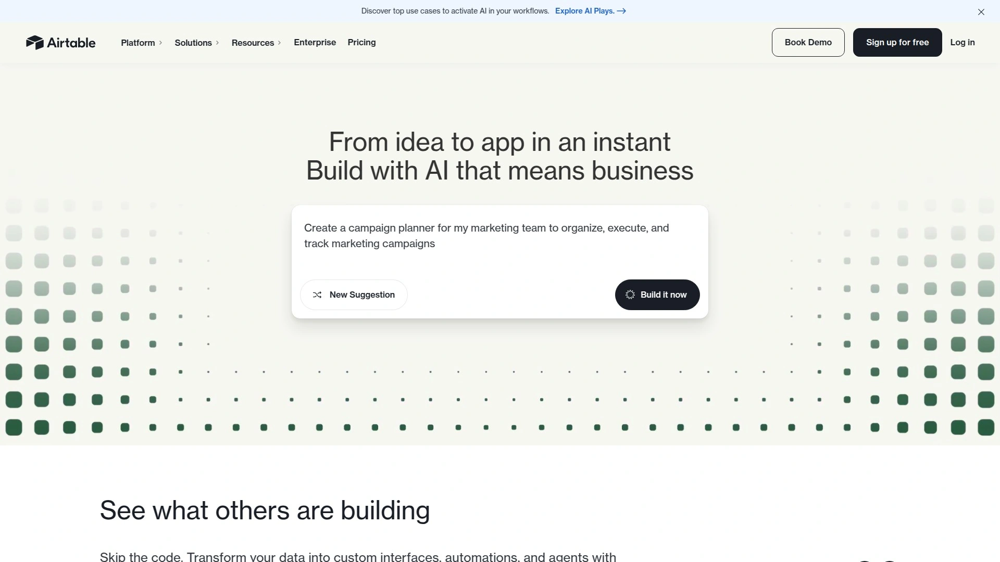

Airtable combines spreadsheet familiarity with database power, creating versatile tools for diverse use cases. Relational databases link records across tables, enabling sophisticated project tracking, content calendars, and inventory management. Multiple views including grid, calendar, kanban, gallery, and form accommodate different interaction needs.

Automation builder creates workflows connecting triggers to actions without coding. Integrations with TickTick, Zapier, and thousands of other apps through various platforms extend functionality. Collaboration features support real-time editing, comments, and permissions.

Custom fields of various types (text, number, attachment, checkbox, dropdown, etc.) structure data precisely for specific needs. Form views collect information from external sources directly into Airtable tables. API access enables custom integrations and workflows.

Free plan supports unlimited bases with usage limits, while paid plans starting at $20 per user monthly add advanced features. Airtable suits teams building custom workflows that pre-built project management tools can't accommodate.

## [TimeHero](https://timehero.com)

An automated project planning tool that schedules tasks based on dependencies, priorities, and team availability.

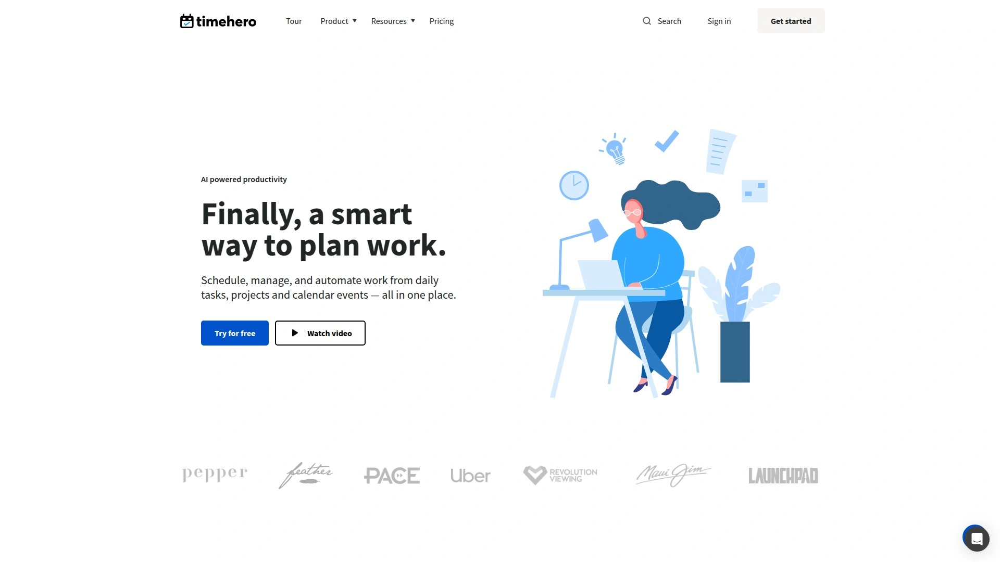

TimeHero automates project planning by analyzing task dependencies and team capacity to create realistic schedules. The platform ensures everything stays on track by automatically adjusting schedules when tasks take longer than estimated or priorities shift. This dynamic scheduling reduces manual planning burden.

Integration with ClickUp through Zapier enables automated task creation and updates between platforms. Task dependencies ensure work happens in the correct sequence. Team member availability informs scheduling decisions, preventing overallocation.

Project completion reporting provides visibility into progress and bottlenecks. The automation-first approach works well for teams with predictable workflows and clear dependencies. Less suitable for highly dynamic environments requiring constant manual intervention.

Zapier integration connects TimeHero to thousands of other business tools. The platform targets project managers needing automated scheduling rather than individuals managing personal tasks.

***

### How do AI scheduling tools actually save time in practice?

AI schedulers eliminate the 15-30 minutes daily typically spent manually arranging your calendar by automatically placing tasks in optimal time slots and instantly rearranging everything when meetings change. Most users report reclaiming 5+ hours weekly previously lost to schedule management, calendar Tetris, and deciding what to work on next.

### Can these tools integrate with my existing calendar and project management systems?

Most modern productivity platforms integrate with Google Calendar, Outlook, iCloud, and popular task managers like Todoist, Asana, and Notion. Check each platform's integration list before committing, as connection depth varies—some offer full two-way sync while others only import data one direction.

### What's the difference between scheduling assistants and full productivity platforms?

Scheduling assistants like Calendly and Doodle focus specifically on booking meetings with minimal features for task management. Full productivity platforms like Motion and Reclaim combine calendar management, task scheduling, and project tracking into unified systems that plan your entire workday.

***

### Conclusion

Stop letting calendar chaos steal hours from your actual work. The right AI-powered productivity tool transforms overwhelming schedules into executable plans that adapt throughout your day without constant manual shuffling. For teams and individuals wanting comprehensive automation that handles tasks, meetings, and deadlines in one intelligent system, [Motion](#motion) delivers the most complete solution by actually building your perfect workday rather than just managing pieces of it, making it especially suitable for professionals tired of living in calendar hell who need their planning tool to think ahead for them.
